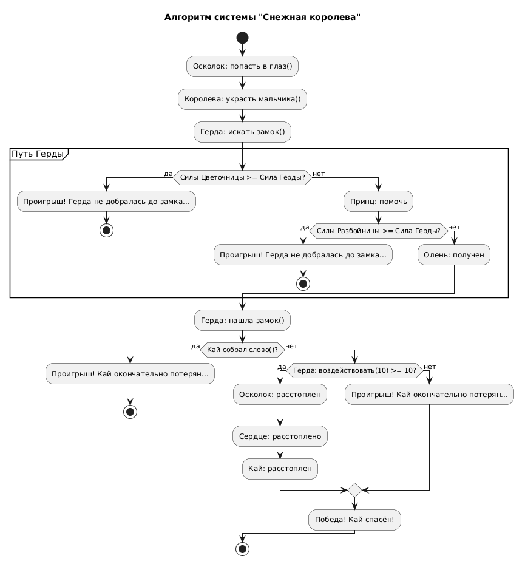

# Activity Diagram: Алгоритм системы "Снежная королева"

## Обзор

Эта диаграмма активности показывает алгоритм работы системы "Снежная королева" в контексте восстановления данных и спасения Кая.

## Описание потока

### Шаг 1: Начало конфликта
- Осколок зеркала попадает в глаз Кая
- Снежная королева похищает мальчика

### Шаг 2: Начало поисков
- Герда отправляется искать замок Снежной королевы

### Шаг 3: Путь Герды (серия испытаний)

#### Испытание 1: Цветочница
- Проверка: Сила Цветочницы >= Сила Герды?
- **Если да** — Герда проигрывает, останавливается у цветочницы
- **Если нет** — Герда продолжает путь

#### Испытание 2: Разбойница
- Проверка: Сила Разбойницы >= Сила Герды?
- **Если да** — Герда проигрывает, не может продолжить путь
- **Если нет** — Герда получает оленя и продолжает путь

### Шаг 4: Обнаружение замка
- Герда находит замок Снежной королевы

### Шаг 5: Проверка состояния Кая
- Проверка: Кай собрал слово?
- **Если да** — Кай окончательно потерян (проигрыш)

### Шаг 6: Спасение Кая
- Герда воздействует на осколок (сила = 10)
- Проверка: сила Герды >= прочность льдинки (10)?
- **Если да (10 >= 10)**:
  - Осколок растоплен
  - Сердце Кая растоплено
  - Кай спасён (победа)
- **Если нет** — Кай окончательно потерян (проигрыш)

## Точки принятия решений

| Условие | Результат |
|---------|----------|
| Сила Цветочницы >= Сила Герды  | Да/Нет (зависит от сценария) |
| Сила Разбойницы >= Сила Герды  | Да/Нет (зависит от сценария) |
| Кай собрал слово? | Да — поражение, Нет — возможность спасения |
| Герда: воздействовать(10) >= прочность льдинки (10) | Да — победа, Нет — поражение |

## Ключевые элементы

| Элемент | Роль |
|---------|------|
| **Осколок** | Инициирует проблему (попадает в глаз Кая) |
| **Снежная королева** | Антагонист, похищает Кая |
| **Цветочница** | Первое препятствие на пути Герды |
| **Принц** | Помощник, ускоряет путь к замку, вызывает столкновение с **Разбойницей** |
| **Разбойница** | Второе препятствие на пути Герды |
| **Олень** | Помощник, ускоряет путь к замку |
| **Собранное слово** | Условие поражения (Кай забыт) |
| **Льдинка** | Финальное препятствие (прочность = 10) |

## Заметки

- Герда обладает силой = 10, что равно прочности льдинки
- Если Герда преодолевает все препятствия, она успевает спасти Кая до того, как тот соберёт слово
- Олень выступает ключевым помощником, который сокращает путь к замку

- ## Диаграмма
- 


```
@startuml
skinparam conditionStyle inside
title Алгоритм системы "Снежная королева" 

start

:Осколок: попасть в глаз();
:Королева: украсть мальчика();
:Герда: искать замок();
partition "Путь Герды" {

    if (Силы Цветочницы >= Сила Герды?) then (да)
        :Проигрыш! Герда не добралась до замка...;
        stop
    else (нет)
        :Принц: помочь;
        if (Силы Разбойницы >= Сила Герды?) then (да)
            :Проигрыш! Герда не добралась до замка...;
            stop
        else (нет)
            :Олень: получен;
        endif
    endif
}
:Герда: нашла замок();
if (Кай собрал слово()?) then (да)
    :Проигрыш! Кай окончательно потерян...;
    stop
else (нет)
    if (Герда: воздействовать(10) >= 10?) then (да)
        :Осколок: расстоплен;
        :Сердце: расстоплено;
        :Кай: расстоплен;
    else (нет)
    :Проигрыш! Кай окончательно потерян...;
    endif
  :Победа! Кай спасён!;
endif


stop
@enduml
```
