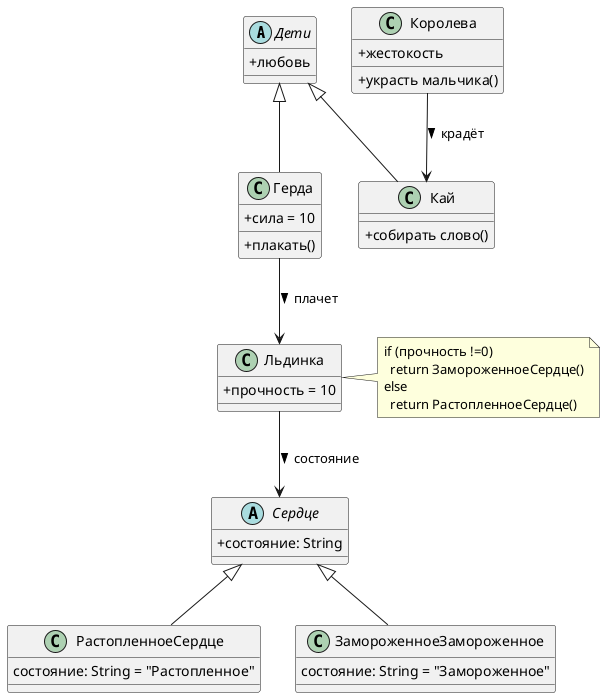

# Class Diagram: Снежная королева (восстановление данных)

## Обзор

Эта диаграмма классов показывает объектно-ориентированную структуру системы сказки «Снежная королева» в контексте восстановления данных.

## Иерархия классов

### Иерархия детей

| Class | Type | Attributes | Methods |
|-------|------|------------|---------|
| Дети | Abstract | + любовь: int | - |
| Герда | Concrete | + сила = 10 | + плакать() |
| Кай | Concrete | - | + собирать_слово() |

### Злодей

| Class | Type | Attributes | Methods |
|-------|------|------------|---------|
| Королева | Concrete | + жестокость: int | + украсть_мальчика() |

### Иерархия сердца

| Class | Type | Attributes | Methods |
|-------|------|------------|---------|
| Сердце | Abstract | + состояние: String | - |
| ЗамороженноеСердце | Concrete | + состояние = "Замороженное" | extends Сердце |
| РастопленноеСердце | Concrete | + состояние = "Растопленное" | extends Сердце |

### Вспомогательный элемент

| Class | Type | Attributes | Methods |
|-------|------|------------|---------|
| Льдинка | Concrete | + прочность = 10 | - |

## Связи

- **Королева --> Кай**: крадёт 
- **Герда --> Льдинка**: плачет 
- **Льдинка --> Сердце**: определяет состояние 

## Диаграмма

