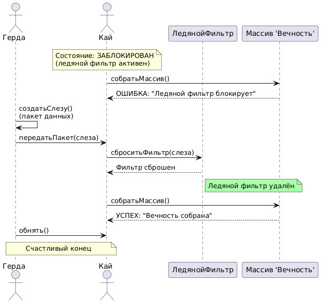

# Sequence Diagram: Взаимодействие в системе "Снежная королева"

## Обзор

Эта диаграмма последовательности показывает пошаговое взаимодействие между актерами и объектами в системе "Снежная королева" для восстановления данных и спасения Кая.

## Актеры и участники

| Актер/Участник | Описание |
|----------------|----------|
| Герда | Девочка, которая спасает Кая, создаёт слезу (пакет данных) |
| Кай | Мальчик, заблокированный ледяным фильтром, пытается собрать массив "Вечность" |
| ЛедянойФильтр | Блокирующий компонент, мешающий Каю получить доступ к массиву |
| Массив 'Вечность' | Целевой массив данных, который нужно собрать |

## Шаги взаимодействия

### Шаг 1: Исходное состояние
- Кай находится в состоянии ЗАБЛОКИРОВАН (ледяной фильтр активен)
### Шаг 2: Первая попытка Кая
- Кай пытается собрать массив "Вечность"
- Массив возвращает ошибку: "Ледяной фильтр блокирует"

### Шаг 3: Создание слезы Гердой
- Герда создаёт слезу (пакет данных)

### Шаг 4: Передача пакета
- Герда передаёт пакет (слезу) Каю

### Шаг 5: Сброс фильтра
- Кай вызывает сброс фильтра, передавая слезу
- Ледяной фильтр удаляется (состояние меняется)

### Шаг 6: Успешный сбор массива
- Кай повторно пытается собрать массив "Вечность"
- Массив возвращает успех: "Вечность собрана"

### Шаг 7: Завершение
- Герда обнимает Кая (счастливый конец)

## Ключевые наблюдения

1. Исходно Кай заблокирован ледяным фильтром и не может собрать массив.
2. Герда выступает источником "слезы" — специального пакета данных, который снимает блокировку.
3. Слеза передаётся от Герды к Каю, после чего Кай сбрасывает фильтр.
4. Только после сброса фильтра Кай успешно собирает массив "Вечность".
5. Финальное объятие символизирует восстановление связи и счастливый конец.



## Диаграмма
```
@startuml

actor "Герда" as Gerda
actor "Кай" as Kay
participant "ЛедянойФильтр" as Filter
participant "Массив 'Вечность'" as Eternity

' Исходное состояние: Кай заблокирован
note over Kay: Состояние: ЗАБЛОКИРОВАН\n(ледяной фильтр активен)

Kay -> Eternity : собратьМассив()
Eternity --> Kay : ОШИБКА: "Ледяной фильтр блокирует"

' Герда создаёт слезу
Gerda -> Gerda : создатьСлезу()\n(пакет данных)

' Передача слезы
Gerda -> Kay : передатьПакет(слеза)

' Внутреннее событие таяния
Kay -> Filter : сброситьФильтр(слеза)
Filter --> Kay : Фильтр сброшен
note right of Filter #AAFFAA: Ледяной фильтр удалён

' Теперь Кай может собрать массив
Kay -> Eternity : собратьМассив()
Eternity --> Kay : УСПЕХ: "Вечность собрана"

' Завершающее взаимодействие
Gerda -> Kay : обнять()
note over Gerda, Kay : Счастливый конец

@enduml
```
