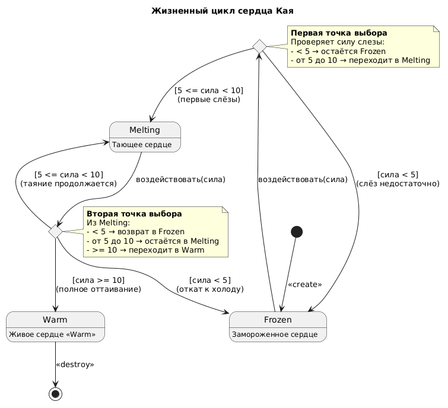

# State Diagram: Жизненный цикл сердца Кая

## Обзор

Эта диаграмма состояний показывает, как сердце Кая меняется под воздействием любви и слез Герды — от ледяного состояния к живому.

## Состояния

| Состояние | Описание |
|-----------|----------|
| Frozen (Лед) | Сердце заморожено, Кай холоден и равнодушен (начальное состояние) |
| Melting (Тает) | Сердце начинает оттаивать, появляются первые чувства |
| Warm (Живое) | Сердце полностью растоплено, Кай спасён (конечное состояние) |

## Переходы

| От | К | Условие |
|----|---|----------|
| Frozen | Melting | сила слезы >= 5 (первые слёзы Герды) |
| Frozen | Frozen | сила слезы < 5 (недостаточно) |
| Melting | Warm | сила слезы >= 10 (полное раскаяние и любовь) |
| Melting | Melting | 5 <= сила < 10 (недостаточно для полного оттаивания) |
| Melting | Frozen | сила < 5 (откат назад, если слёзы иссякли — редко) |

## Ключевые наблюдения

- Начальное состояние — **Frozen** (как «Целое яйцо» в примере)
- Точки выбора (choice) проверяют силу воздействия (слёзы Герды)
- При силе >= 10 сердце переходит в **Warm** (финальное, как «Разбитое яйцо»)
- Промежуточное состояние **Melting** добавлено для большей детализации

## Диаграмма




```plantuml
@startuml
skinparam state {
  BackgroundColor<<Warm>> #lightgreen
  BackgroundColor<<Frozen>> #lightblue
  BackgroundColor<<Melting>> #lightyellow
}

title Жизненный цикл сердца Кая

[*] --> Frozen : <<create>>

state Frozen : Замороженное сердце
state Melting : Тающее сердце
state Warm : Живое сердце <<Warm>>

state choice1 <<choice>>
state choice2 <<choice>>

Frozen --> choice1 : воздействовать(сила)

choice1 --> Frozen : [сила < 5]\n(слёз недостаточно)
choice1 --> Melting : [5 <= сила < 10]\n(первые слёзы)

Melting --> choice2 : воздействовать(сила)

choice2 --> Melting : [5 <= сила < 10]\n(таяние продолжается)
choice2 --> Warm : [сила >= 10]\n(полное оттаивание)
choice2 --> Frozen : [сила < 5]\n(откат к холоду)

Warm --> [*] : <<destroy>>

note right of choice1
  **Первая точка выбора**
  Проверяет силу слезы:
  - < 5 → остаётся Frozen
  - от 5 до 10 → переходит в Melting
end note

note right of choice2
  **Вторая точка выбора**
  Из Melting:
  - < 5 → возврат в Frozen
  - от 5 до 10 → остаётся в Melting
  - >= 10 → переходит в Warm
end note

@enduml
