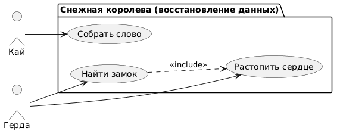

# Use Case Diagram: Управление золотыми активами

## Актеры

| Актер | Описание |
|-------|-------------|
| Герда | Девочка |
| Кай | Мальчик |

## Варианты использования

### Восстановление данных

| Вариант использования | Описание |
|----------|-------------|
| Собрать слово |  Собрать слово "вечность" |
| Найти замок |  Найти замок |
| Расстопить сердце | Расстопить сердце |

## Связи

### Актер к варианту использования

- **Герда** выполняет:  Найти замок
- **Герда** выполняет: Расстопить сердце
- **Кай** выполняет: Собрать слово "вечность"

### Отношения Extend/Include

- **Найти замок** →→ **Расстопить сердце** (<<include>>)

## Диаграмма


```
@startuml
actor "Кай" as kay
actor "Герда" as gerda

package "Управление золотыми активами" {
  usecase "Собрать слово" as word
  usecase "Найти замок" as find_castle
  usecase "Растопить сердце" as melt_heart
}
kay-->word
gerda--> find_castle
gerda--> melt_heart

find_castle ..> melt_heart : <include>
@enduml :
```
